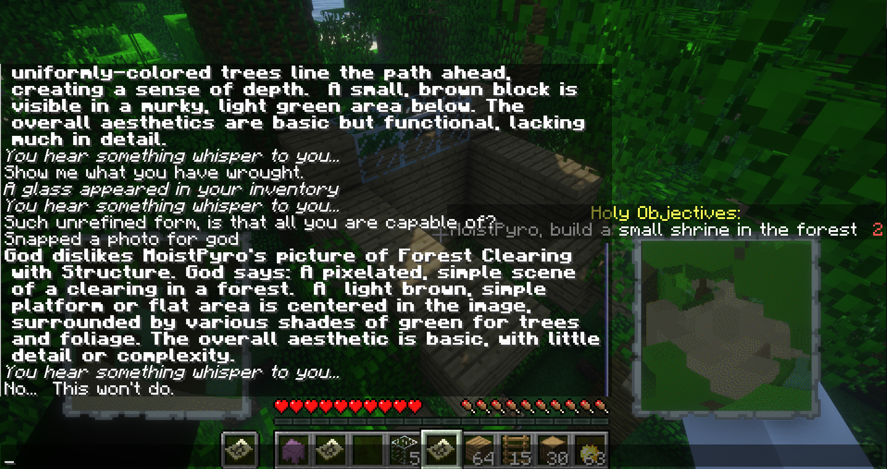

#  Gemini AI God Bukkit Plugin
Modified version of the [ChatGPT bukkit plugin by "BigYous"](https://github.com/YOUSY0US3F/minecraft-gpt-god-plugin) which uses the google gemini (within free-tier limits) to provide an improved AI roleplay experience free of charge. Join a world ruled by the AI and hope that your new overlord is having a good day. You will be sent on missions from God, have your buildings and photos judged, be rewarded greatly, or explode spectacularly. Tread carefully....... it see's and hears everything....


What's Changed:

- [x] Ported to google gemini from chatgpt
    - scrapped all openai support at the moment in favour of full gemini consistency for now
    - [x] context window is now one million for `gemini-1.5-flash` and 2 million for `gemini-1.5-pro`
    - [x] Voice transcription requests are now bundled (to avoid api spam) and using the gemini 1.5 flash model
    
- [x] Ported voice synthesis to Speechify (super godly narrator voice for free! IT EVEN BREATHES!)
- [x] Improved context handling (cured the AI god of dementia)
- [x] separated model usage into "primary" and "secondary" model so that a cheaper model may be used for medial tasks
- [x] decreased call count to primary model and unified commands and communication behaviour to one context 
- [x] Added real multi-turn mode (including model responses in context)
- [x] Improved system instruction prompt design for better roleplay output
- [x] Gave the AI a better sense of time using minecraft time of day timestamps
- [x] various bug fixes and codebase improvements
- [x] added new decree function for the ai to drop floating commandments in the world if it is displeased
- [x] added model temperature configuration control to improve model creativity
- [x] Rolling context expiry for new multi-turn when token limit is approaching
- [x] Give the AI eyes using the papermc ImageryAPI and gemini vision api (so the AI can decide if your monuments to its honor are ugly or not)
  - [x] Added player camera item (get with `/givecamera`) for fun photography for god missions
  - [x] Functioning structure rendering with automatic camera positioning
- [x] Created sequential but non-blocking thread queue for the api wrapper class (AsyncTaskQueue in GptAPI)

Todo:

- [ ] Maybe add option to choose between gemini and open ai?
- [ ] Fix bug with events coming in after round restart (cut off async threadpool of logger on reset or associate events with some kind of session id)
- [ ] selfie mode for god camera
- [ ] spawn sound and particle effects on camera shutter
- [ ] Add ability to save favourite structures and scatter them across the new map on round start
- [ ] Add option to renderer to ignore all blocks not in a structure (so that trees don't block the view and make the ai think you built a bush)
- [ ] Give god a tool to give a user the camera they would otherwise get from `/givecamera`

## Local Setup

- clone the repo
- run `./gradlew` in the root of the repo
- download [paper mc server version 1.21.1](https://papermc.io/downloads/paper)
- setup the server
- download [voicechat bukkit plugin 2.5.24](https://modrinth.com/plugin/simple-voice-chat/version/bukkit-2.5.24)
- download [imagery api 1.2.1](https://github.com/jensjeflensje/minecraft_imagery/releases/tag/1.2.1)
- download [ImageFrame 1.7.10](https://hangar.papermc.io/LOOHP/ImageFrame/versions) for printing out photos on maps
- place the jar files in the plugins folder of your server
- [install fabric for 1.21.1](https://fabricmc.net/use/installer/)
- [download the fabric api jar for extra mod compatibility](https://www.curseforge.com/minecraft/mc-mods/fabric-api/files/5848063)
- download [the voice chat mod version 1.21.1-2.5.24 for fabric](https://modrinth.com/plugin/simple-voice-chat/version/fabric-1.21.4-2.5.24)
- place those in your mods folder in .minecraft
- (Optional) [install iris + sodium](https://www.irisshaders.dev/) and [BSL Shaders](https://www.curseforge.com/minecraft/shaders/bsl-shaders) for a more godly experience

## Config
- Get a free gemini api key from [aistudio.google.com/](https://aistudio.google.com/)
- Get a free speechify api key from [console.sws.speechify.com/tts](https://console.sws.speechify.com/tts)
- configure primary model to be `model-name: gemini-1.5-pro` for smarter role-play output at slower speeds. Both models are fun, so give them both a try
- configure primary model to be `model-name: gemini-1.5-flash` if you want fast model times such as `rate: 30` or below.
    - **NOTE:** Do not go below 30-32 on the free tier pro model or you will hit your 2 requests per minute and 50 requests per day fast
    - **NOTE:** if you set your primary model to `gemini-1.5-flash` then set secondary to `gemini-1.5-flash-8b` as free-tier rate limits are per-model name
    - **do not** use the `1.0` models or other models which are not [multimodal](https://cloud.google.com/use-cases/multimodal-ai) for secondary model. This program relies on the audio and visual processing of the latest Gemini 1.5 models.
    - the flash model can go below 20 and performs quite nicely with the rapid feedback
    - for a fast-feedback experience try setting both models to `gemini-1.5-flash` and try a rate of about `rate: 20` to `rate: 30`
    - do NOT use `gemini-1.5-pro` as the secondary model



## Building

- use the shadowjar task to build
- the jar will appear in build/libs
- place this jar in the plugins folder of the server

## Development

*development requires jdk 21 and gradle version 7.4*

Workspace has been setup for VSCode as well.

plugin jar releases show up under `<project_dir>\build\libs`

## Windows
A release build may be generated with the included bat file for convenience.
```bash
I:\DEVELOPER\PROJECTS\minecraft-gpt-god-plugin>gradlew shadowJar
Starting a Gradle Daemon, 2 incompatible and 1 stopped Daemons could not be reused, use --status for details

BUILD SUCCESSFUL in 3s
3 actionable tasks: 3 up-to-date
I:\DEVELOPER\PROJECTS\minecraft-gpt-god-plugin>
```

## *Nix

install gradle 7.4, and jdk 21 then:

```bash
~> gradle shadowJar
```

## Running

- run the server once then go to `plugins/gptgodmc/config.yml`
- paste in your ~~OpenAi API or~~ Gemini key
- run the server again
- launch minecraft with fabric (make sure voice chat mod is installed)
- **NOTE:** on MacOS you need to use a [launcher such as prisim](https://prismlauncher.org/) to allow microphone access permission to for the plugin
  - [more info here](https://modrepo.de/minecraft/voicechat/wiki/macos)
- finally, connect to the server at `localhost`
